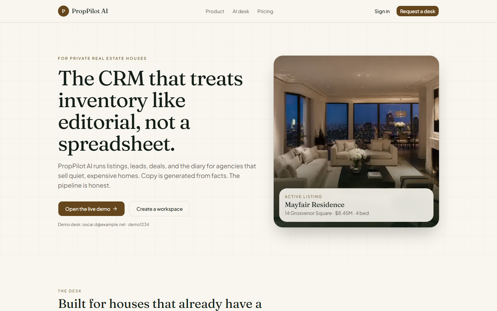
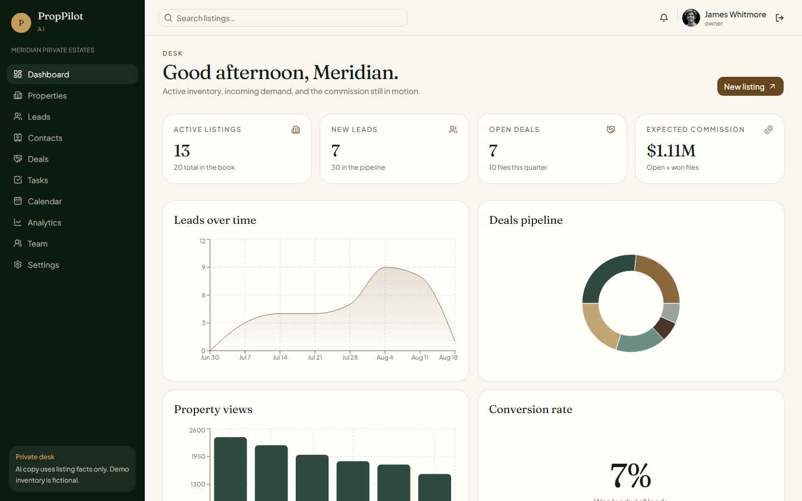
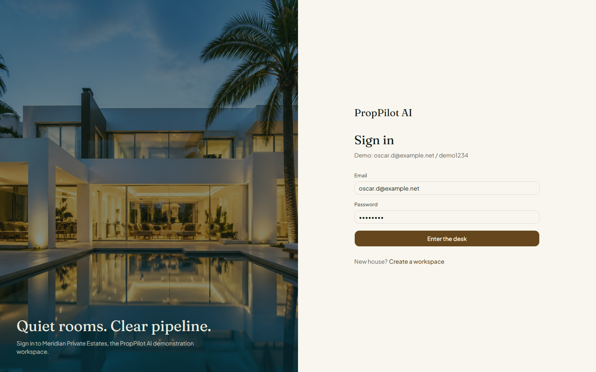
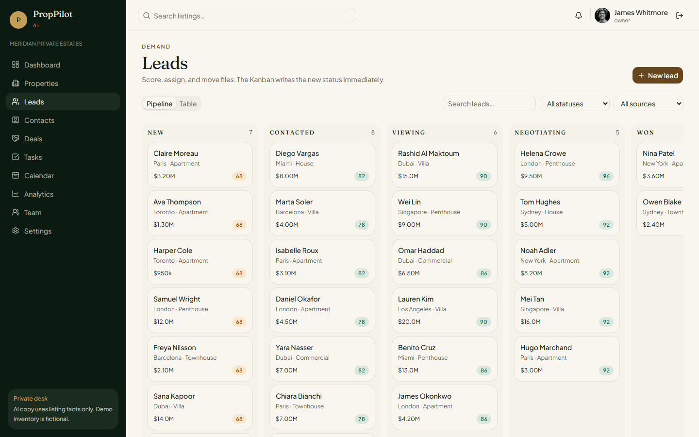
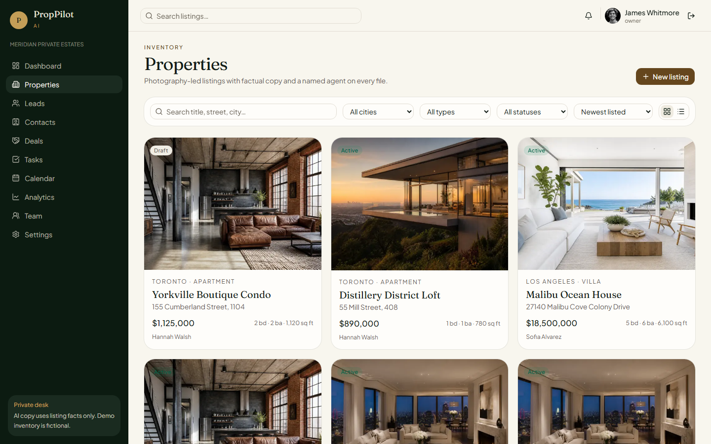
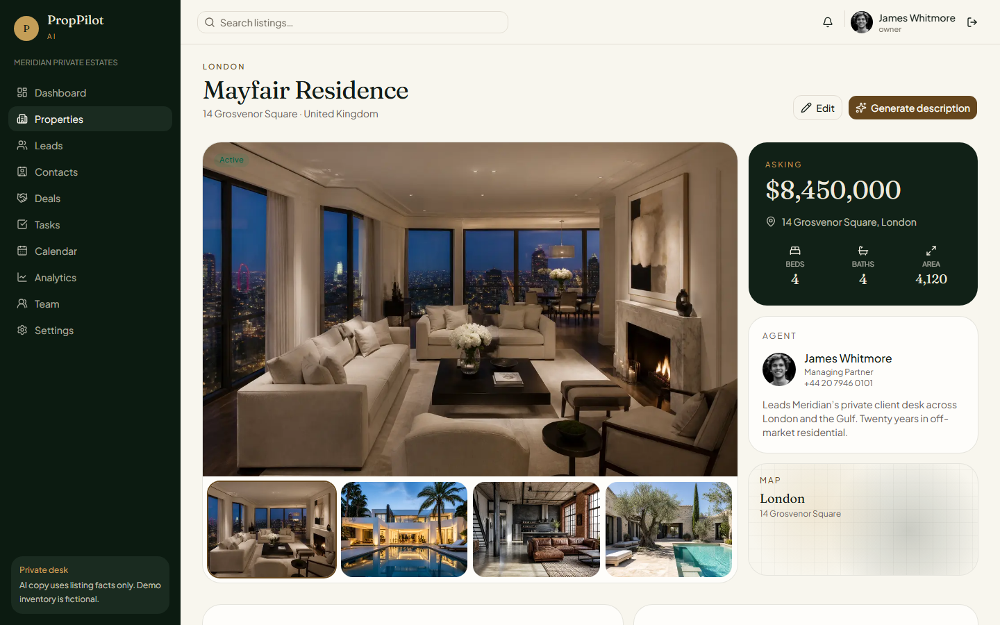
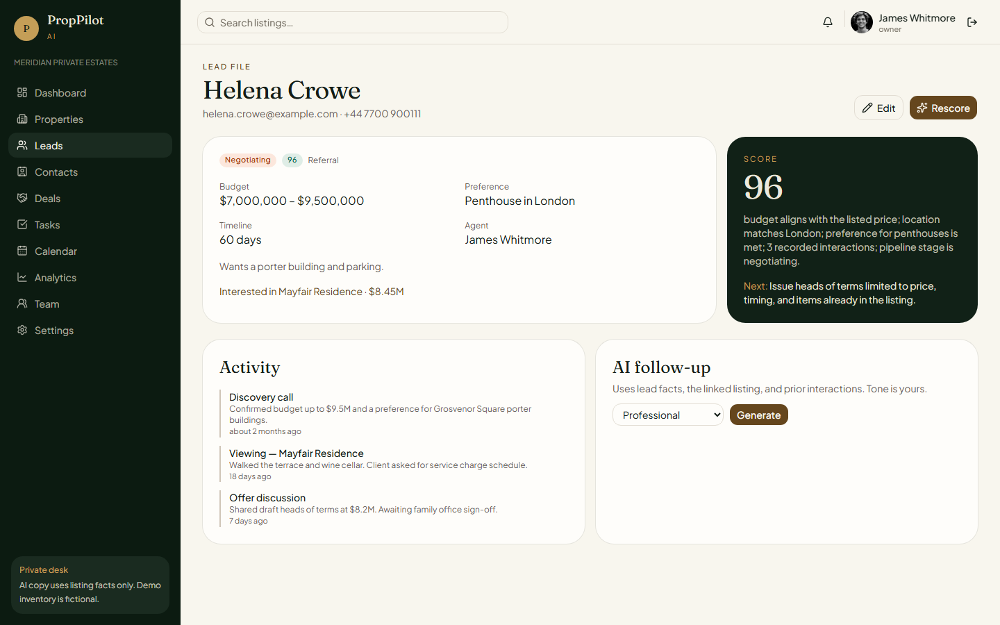
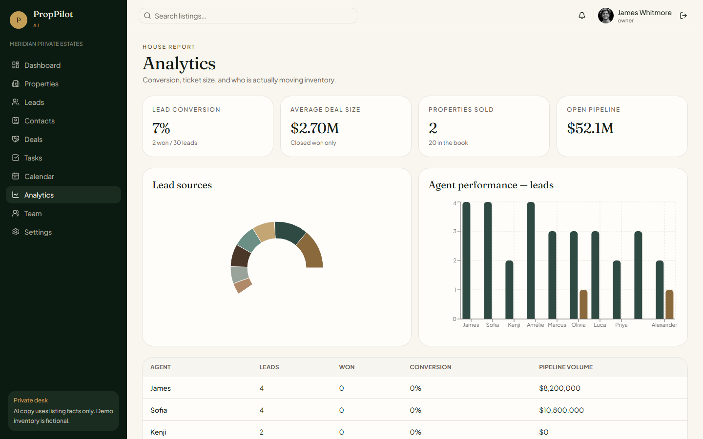
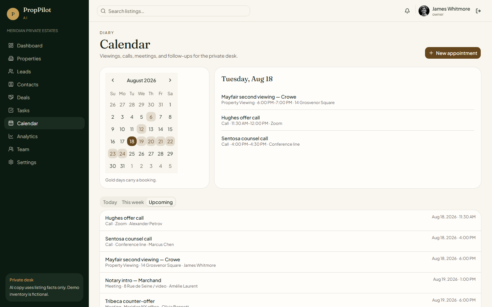

# PropPilot AI

Premium CRM for private-client real estate houses. Listings, pipeline, diary, analytics, and AI copy that is **not allowed to invent property facts**.

**Live demo:** [https://proppilot-ai-eta.vercel.app/](https://proppilot-ai-eta.vercel.app/)

The demo workspace is **Meridian Private Estates**. Inventory, leads, and names are fictional. No API keys.

[Product](#product) · [Demo](#demo) · [Stack](#stack) · [Run locally](#run-locally) · [License](#license)

---

## Product

| Area | Behaviour |
| --- | --- |
| Marketing site | Landing, login, register, demo desk |
| Dashboard | Active listings, new leads, open deals, expected commission, charts, diary, activity |
| Properties | Grid + list, search, filters, sort, create / edit, photo-led detail |
| Property file | Gallery, facts, agent, map placeholder, lead activity, appointments, AI desk |
| Leads | Table + Kanban with drag-and-drop status persistence |
| Lead file | Score + reason + next action, follow-up drafts (email / SMS / WhatsApp) |
| Contacts, deals, tasks, calendar | Full CRUD with empty and success states |
| Analytics | Conversion, deal size, sources, agent performance |
| Team / settings | Roster, profile, workspace, demo reset |

### AI desk

Prompts send **only recorded facts**. Missing amenities, views, schools, and lifestyle claims are omitted — never guessed.

- Listing headline, long / short copy, SEO, Instagram, Facebook
- Lead scores with a reason and a recommended next action
- Follow-ups as email, SMS, and WhatsApp in four tones

The writer in `src/lib/ai/fallback.ts` uses only recorded facts. No API key.

## Demo

Open [https://proppilot-ai-eta.vercel.app/](https://proppilot-ai-eta.vercel.app/) and sign in:

```
oscar.d@example.net
demo1234
```

Auth and CRM data live in the browser. Nothing is stored on a server.

<p align="center">
  
</p>

<p align="center">
  
</p>

| Sign in | Pipeline |
| --- | --- |
|  |  |

| Listings | Property file |
| --- | --- |
|  |  |

| Lead file | Analytics |
| --- | --- |
|  |  |

<p align="center">
  
</p>

## Stack

- **Next.js 16** (App Router) + TypeScript
- **Tailwind CSS v4** + shadcn/ui
- **Zustand** + `localStorage` (no database)
- **Zod** + React Hook Form
- Recharts, Lucide, @dnd-kit
- Grounded AI writer in `src/lib/ai/fallback.ts` — no API key

## Run locally

No `.env`, no OpenAI, no Supabase.

```bash
npm install
npm run dev
```

Sign in with the demo desk above.

```bash
npm run build
npm run typecheck
npm run lint
```

## How the demo works

| Piece | Where it lives |
| --- | --- |
| Login | Local demo account in the browser |
| CRM data | Zustand + `localStorage` |
| Seed book | 20 properties, 30 leads, 10 agents in `src/lib/demo-data.ts` |
| AI copy / scores / follow-ups | Deterministic writer from recorded facts only |
| Reset | Settings → Restore fictional inventory |

A Postgres schema exists in `supabase/schema.sql` as a sketch of a future backend. This portfolio build does not use it.

## Architecture

- CRM mutations go through `src/lib/store.ts`.
- Route group `(crm)` wraps authenticated pages in the forest sidebar (`src/components/layout/app-shell.tsx`).
- `/api/ai/*` never invents listing attributes.

## License

Portfolio demonstration. See [LICENSE](LICENSE).
